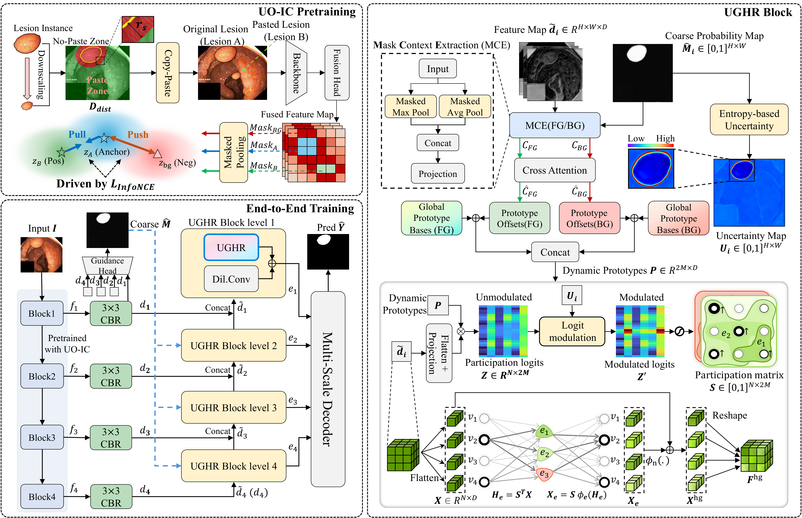
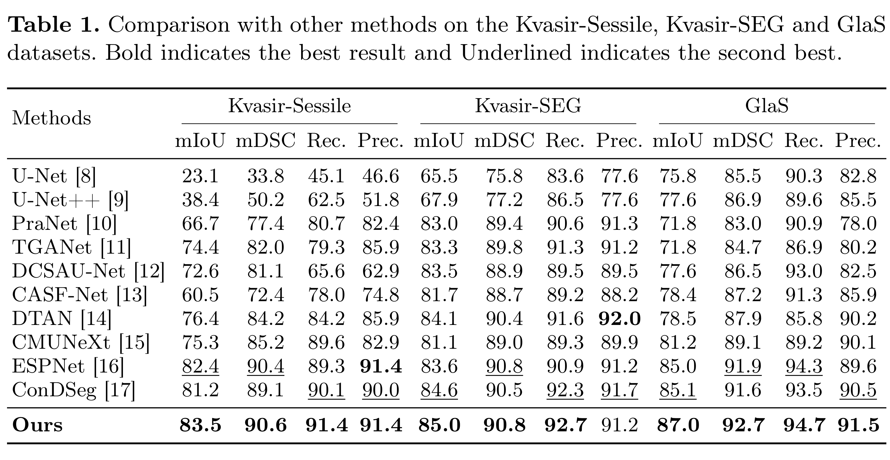

# UHR-Net

**An Uncertainty-Aware Hypergraph Refinement Network for Medical Image Segmentation**

<p align="center">
  <a href="https://arxiv.org/abs/2604.28095"></a>
  <a href="https://github.com/CUGfreshman/UHR-Net"></a>
  
</p>

<p align="center">
  <strong>English</strong> | <a href="README_CN.md">简体中文</a>
</p>

<p align="center">
  
</p>

## Overview

**UHR-Net** combines instance-level contrastive pretraining with uncertainty-guided structured refinement to alleviate small-lesion cue dilution, lesion-like background interference, and unstable predictions in ambiguous regions.

### Uncertainty-Oriented Instance Contrastive Pretraining (UO-IC)

- UO-IC is an instance-level contrastive pretraining strategy that combines geometry-constrained copy-paste augmentation with lesion-like background hard-negative mining to alleviate small-lesion cue dilution and lesion-like background interference.
- Positive pairs are constructed by geometry-constrained copy-paste: an original lesion, Lesion A, is randomly scaled and pasted as Lesion B; masked average pooling is then used to obtain the original-lesion feature `z_A` and the pasted-lesion feature `z_B`, respectively. Negative samples come from lesion-like background regions with high predicted foreground probabilities; weighted masked average pooling is used to obtain the lesion-like background feature `z_bg`, which serves as in-batch hard negatives.
- Based on the above positive and negative samples, UO-IC adopts InfoNCE for instance-level contrastive optimization, pulling the original-lesion feature `z_A` closer to its scaled-and-pasted replica feature `z_B` while pushing `z_A` away from the lesion-like background feature `z_bg`, thereby alleviating small-lesion cue dilution and lesion-like background interference.

### Uncertainty-Guided Hypergraph Refinement Blocks (UGHR)

- **UGHR blocks** are embedded into the multi-scale decoder path to refine decoder features during segmentation. Each UGHR block takes the fused feature at the current scale and the coarse segmentation probability map as input, and outputs the refined feature.
- UGHR computes an entropy-based uncertainty map from the coarse segmentation probability map and uses this uncertainty to modulate node-hyperedge participation logits before normalization. This allows high-uncertainty locations to receive larger normalized participation weights, so that subsequent hypergraph message passing can more effectively aggregate contextual information from these regions.
- UGHR splits hyperedge prototypes into foreground and background groups, and extracts foreground/background contexts from the coarse segmentation prior to generate dynamic prototypes. These foreground/background-conditioned hyperedge prototypes are used to decouple higher-order interactions, reduce boundary interference, and strengthen refinement in uncertain regions.

## Main Results

The following table reports the main quantitative results of UHR-Net on **Kvasir-Sessile, Kvasir-SEG, and GlaS**.

<p align="center">
  
</p>

## Quick Start

### 1. Environment Setup

Create a conda environment and install the dependencies:

```bash
git clone https://github.com/CUGfreshman/UHR-Net.git
cd UHR-Net

conda create -n uhrnet python=3.10 -y
conda activate uhrnet

# Install the PyTorch version that matches your local CUDA version
pip install torch torchvision
pip install opencv-python albumentations numpy scipy scikit-image scikit-learn tqdm
```

If the default `pip install torch torchvision` does not install the CUDA version you need, please reinstall PyTorch with the official command that matches your local CUDA version.

### 2. Data Preparation

The default scripts read datasets from `--data-root`. The dataset directory name is not fixed; it only needs to be consistent with the `--dataset` argument in the running command. Below is an example using `Kvasir-SEG`:

```text
data/
└── Kvasir-SEG/
    ├── images/
    ├── masks/
    ├── train.txt
    ├── val.txt
    ├── test.txt
    └── preprocessed_metadata.pkl   # Generated by the UO-IC preprocessing script below
```

Before UO-IC training, metadata for instances and distance maps required by copy-paste augmentation should be constructed by running the corresponding preprocessing script. The default output is `preprocessed_metadata.pkl` under the dataset directory.

```bash
# Kvasir-SEG
python scripts/preprocess_kvasir.py \
  --data-root data \
  --dataset Kvasir-SEG

# GlaS
python scripts/preprocess_glas.py \
  --data-root data \
  --dataset Glas

# ISIC-2016
python scripts/preprocess_isic2016.py \
  --data-root data \
  --dataset ISIC-2016
```

If preprocessed metadata is already available, you can also specify its path during stage-1 training with `--metadata-path`.

### 3. Stage-1 UO-IC Pretraining

```bash
CUDA_VISIBLE_DEVICES=0 python scripts/train_uoic.py \
  --data-root data \
  --dataset Kvasir-SEG \
  --metadata-path data/Kvasir-SEG/preprocessed_metadata.pkl \
  --output-root run_files \
  --epochs 300 \
  --batch-size 16
```

Training logs and checkpoints are saved by default to:

```text
run_files/<dataset>/stage1_<dataset>_<timestamp>/
```

where `checkpoint.pth` is used for backbone initialization in the next stage.

### 4. End-to-End UHR-Net Training

```bash
CUDA_VISIBLE_DEVICES=0 python scripts/train_uhrnet.py \
  --data-root data \
  --dataset Kvasir-SEG \
  --pretrained-backbone path/to/stage1/checkpoint.pth \
  --output-root run_files \
  --epochs 300 \
  --batch-size 24
```

`--pretrained-backbone` is optional. If it is not provided, the model will start training from a randomly initialized UHR-Net. To resume training from a complete UHR-Net checkpoint, use `--resume path/to/checkpoint.pth`.

Training outputs are saved by default to:

```text
run_files/<dataset>/<dataset>_<timestamp>/
```

### 5. Testing

```bash
CUDA_VISIBLE_DEVICES=0 python scripts/test_uhrnet.py \
  --data-root data \
  --dataset Kvasir-SEG \
  --checkpoint path/to/uhrnet/checkpoint.pth \
  --split val
```

`--checkpoint` is required. `--split` supports `train`, `val`, and `test`; when using `test`, the dataset directory should contain `test.txt`.

The testing script writes the log file by default under the checkpoint directory:

```text
test_<split>.log
```

## Repository Structure

```text
UHR-Net/
├── README.md
├── README_CN.md
├── assets/
│   └── readme/                 # README image assets
├── data/
│   ├── io.py                    # Data-list reading and path parsing
│   ├── segmentation_dataset.py   # Dataset for end-to-end segmentation training
│   └── uoic_dataset.py           # Dataset for UO-IC pretraining and copy-paste construction
├── engine/
│   ├── uhrnet_engine.py          # UHR-Net training/validation logic
│   └── uoic_engine.py            # UO-IC pretraining logic
├── models/
│   ├── resnet.py                 # ResNet backbone
│   ├── ughr.py                   # UGHR block
│   ├── uhr_net.py                # Main UHR-Net architecture
│   └── uoic_pretrain.py          # UO-IC pretraining network
├── scripts/
│   ├── preprocess_glas.py        # GlaS metadata preprocessing
│   ├── preprocess_isic2016.py    # ISIC-2016 metadata preprocessing
│   ├── preprocess_kvasir.py      # Kvasir metadata preprocessing
│   ├── train_uoic.py             # Entry point for UO-IC pretraining
│   ├── train_uhrnet.py           # Entry point for end-to-end UHR-Net training
│   └── test_uhrnet.py            # Testing entry point; outputs IoU logs
└── utils/
    ├── metrics.py                # Loss functions and evaluation metrics
    └── utils.py                  # Logging, random seeds, shuffle, and other utilities
```

## Questions and Support

If you encounter any difficulties with dataset preparation, training, validation, or testing, please feel free to contact us. We will do our best to help.

## Citation

If this project is helpful for your research, please cite:

```bibtex
@misc{cheng2026uhrnet,
  title        = {UHR-Net: An Uncertainty-Aware Hypergraph Refinement Network for Medical Image Segmentation},
  author       = {Cheng, Shuokun and Shi, Jinghao and Sun, Kun},
  year         = {2026},
  eprint       = {2604.28095},
  archivePrefix= {arXiv},
  primaryClass = {cs.CV},
  doi          = {10.48550/arXiv.2604.28095}
}
```
